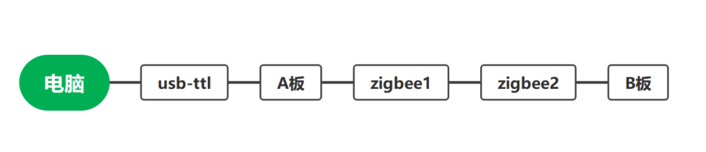

# 第二讲 串口通讯 作业

## 5.作业

### 5.1需要使用：

两块stm32板，一对zigbee，两个usb转ttl接口，需要两个小组合作完成。

### 5.2作业内容

从一块stm32板（简称A板）产生随机两个坐标（a，b）（c，d）（0<a，b，c，d<100，为正整数）,通过usb-ttl将坐标发送到电脑，与此同时用zigbee将坐标通过（DMA方式）发送到另外一块stm32板（简称 B板）上，B板计算两个坐标的曼哈顿距离（|c-a|+|d-b|）,并通过zig-bee将该距离返回给A板，A板再次将收到的曼哈顿距离发送给电脑。



### 5.3注意

1,打印格式为：

```C++
A=(a,b)

B=(c,d)

the distance=(m)//m=|c-a|+|d-b|
```

2,随机数的生成可以使用：

```C++
srand(HAL_GetTick());//HAL_GetTick读取时间

rand()%(k+1)//k为想要的最大值；
```