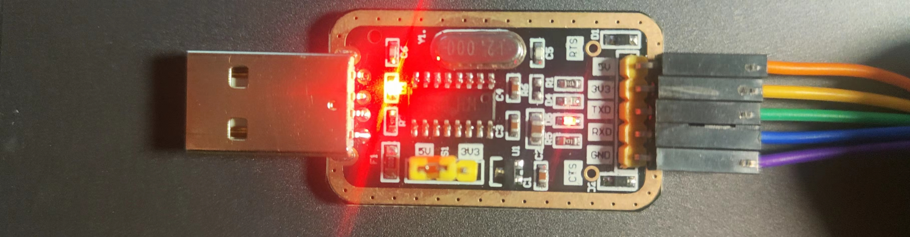
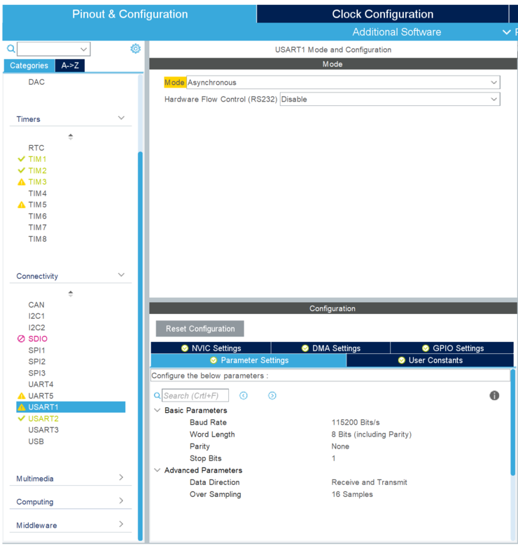
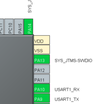
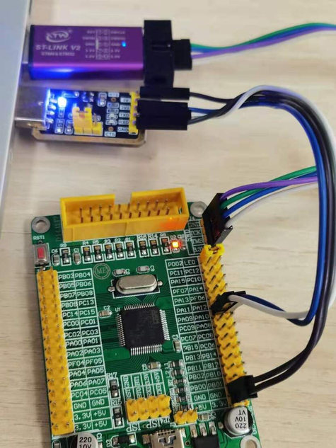
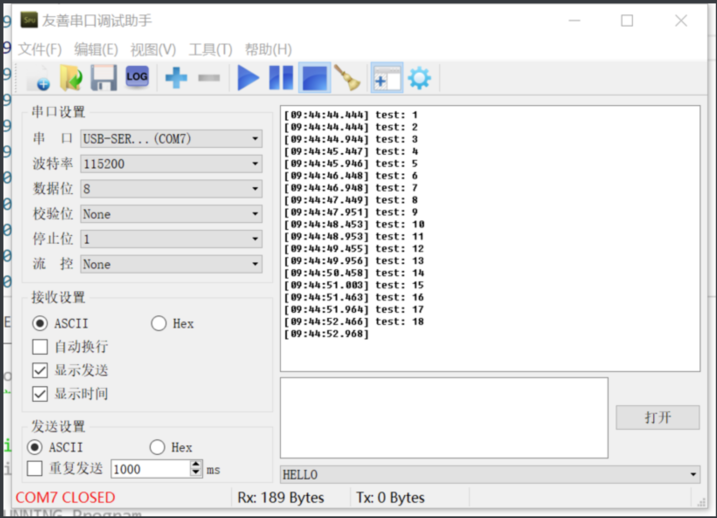

# 02_2022电设第二讲_串口&蓝牙&zigbee

## 2.USB-TTL通信



（左方为usb接口） （右方为ttl（Transistor Transistor Logic）接口）

### 2.1目标

通过USB-TTL实现stm32与电脑的通信（后面主要用来debug）。

本小节需要用到一个USB-TTL模块，一块stm32，并需要在电脑端下载串口调试助手（下载链接：[清华大学云盘 (tsinghua.edu.cn)](https://cloud.tsinghua.edu.cn/d/90001529a9054982bacb/)。

### 2.2CubeMX工程设置

（1）基础设置

参考上一节课程中新建工程相关内容，所有内容基本相同。

链接：

[https://www.wolai.com/tx-leo/cFTmzUo4SoUv61zKbC48HL](https://www.wolai.com/tx-leo/rorj5C3pzTsrUN5e86n6oR)

（2）usart串口开启

在左侧connectivity栏中打开USART1（推荐，否则后续操作需要相应修改），设置模式为Asynchronous（异步），其他设置保持不变（波特率为115200）



此时PA9，PA10被设置为了串口的TX和RX。



（本小节中我们只需要向电脑发送信息而不用从电脑接受信息，故不用打开DMA,DMA的使用在后续蓝牙通信中会进行讲解。）

### 2.3串口连接

UART的通信连接方式为RX接TX，TX接RX。

故将USB-TTL模块与开发板连接，RX-PA9（板子tx），TX-PA10（板子rx）（即在cubemx上设置的usart1通道的rx与tx）GND-GND，5V-5V。如图。其中5v与接地不一定要接，接上的同时会为stm32供电。



### 2.4代码编辑

点击Generate Code，CubeMX会根据我们打开的外设添加新的文件。在VSCode中打开工程文件。

- 打开usart.c
    - 在/* USER CODE BEGIN 0 */与 /* USER CODE END 0 */ 之间添加C语言标准库

```C++
/* USER CODE BEGIN 0 */
#include <stdarg.h>
#include <stdio.h>
#include <string.h>
/* USER CODE END 0 */
```

- 在文件最后的/* USER CODE BEGIN 1 */与 /* USER CODE END 1 */ 之间加一个格式化输出函数

void u1_printf(char* fmt, ...) {
  uint16_t len;
  va_list ap;
  va_start(ap, fmt);
  uint8_t buf[200];
  vsprintf((char*)buf, fmt, ap);
  va_end(ap);
  len = strlen((char*)buf);
  HAL_UART_Transmit(&huart1, buf, len, HAL_MAX_DELAY);//若使用了其他UART通道，将对应通道（参数1）修改即可。该函数在（6.补充）中会进行说明。
}

```C++
/* USER CODE BEGIN 1 */
void u1_printf(char* fmt, ...) {
  uint16_t len;
  va_list ap;
  va_start(ap, fmt);
  uint8_t buf[200];
  vsprintf((char*)buf, fmt, ap);
  va_end(ap);
  len = strlen((char*)buf);
  HAL_UART_Transmit(&huart1, buf, len, HAL_MAX_DELAY);//若使用了其他UART通道，将对应通道（参数1）修改即可。该函数在（6.补充）中会进行说明。
}
/* USER CODE END 1 */
```

HAL_UART_Transmit(&huart1, buf, len, HAL_MAX_DELAY);

- 在usart.h文件中声明该函数：

```C++
/* USER CODE BEGIN Prototypes */
void u1_printf(char* fmt, ...);
/* USER CODE END Prototypes */
```

- 在main.c的主循环中添加周期输出的代码

```C++
/* USER CODE BEGIN WHILE */
  while (1)
  {
    /* USER CODE END WHILE */

    /* USER CODE BEGIN 3 */
    static int cnt = 1;
    u1_printf("test: %d %f\r\n", cnt++, 1.0/cnt);
    HAL_Delay(500);//可以用 delay_ms替换，替换方法本节最后介绍
  }
  /* USER CODE END 3 */
```

### 2.5效果测试

在命令行中输入make，然后烧录到板子上。（不会的同学复习上一节）

打开串口调试助手（下载链接：[清华大学云盘 (tsinghua.edu.cn)](https://cloud.tsinghua.edu.cn/d/90001529a9054982bacb/)，下载完成后打开即可），设置波特率为115200，可以看到通过串口的输出：



ps. 如果串口调试助手波特率设置不正确，会发现屏幕上打出乱码。