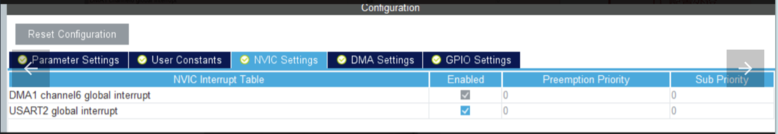

# 02_2022电设第二讲_串口&蓝牙&zigbee

## 3.蓝牙通信


### 3.1目标

通过一个HC05实现stm32与电脑通信，以及两个HC05实现stm32之间的板间通信。

本小节需要两个HC05蓝牙模块与一个USB-TTL串口，需要使用串口调试器。

### 3.2 hc05与电脑的通信

####  3.2.1 HC05与电脑的连接

以windows10系统为例。

首先给HC05模块上电（上电后红灯快速闪烁）然后在电脑蓝牙端进行操作


在蓝牙中找到你的HC05（名字如果未修改则为HC05，图中笔者已经修改过名字），输入pin为1234（如果没有修改），出现下述画面则匹配成功。


在串口调试助手中找到对应的蓝牙串口（各人情况不一样，可以一个个试）


打开通道后，如果蓝牙变为两秒一闪，说明连接成功，可以通过串口助手与蓝牙进行通信。

#### 3.2.2HC05与手机的连接

在手机上下载蓝牙串口spp（[https://cloud.tsinghua.edu.cn/d/916ce7a88e1a407398ff/](https://cloud.tsinghua.edu.cn/d/916ce7a88e1a407398ff/)）


同样给hc05上电（快速闪烁）后，找到相应的hc05后输入1234（或者对应修改后pin）即可成功连接。


####  3.2.3CubeMX工程设置

- 在2.2部分的基础上，打开USART2串口，修改模式为Asynchronous（异步），并修改波特率为9600；默认分配的引脚是PA2（TX），PA3（RX）

    

  

- 为了避免接收时持续等待，我们开启串口接收的DMA，从而可以在DMA的接收中断里处理信息；


  

- 此外，需要在NVIC中打开USART2的全局中断，从而无需阻塞式地等待信息。

  

####  3.2.4串口设置

1.同2.3一样连接stm32与usb-ttl与电脑。

2.连接蓝牙和开发板，如下图。

（rx-tx，tx-rx，vcc-5v，gnd-gnd）


####  3.2.5代码编辑

- 和串口收发类似，在usart.c末尾添加向设备输出的格式化输出函数 u2_printf：

```C++
void u2_printf(char* fmt, ...) { // usart.c末尾
    uint16_t len;
    va_list ap;
    va_start(ap, fmt);
    uint8_t buf[200];
    vsprintf((char*)buf, fmt, ap);
    va_end(ap);
    len = strlen((char*)buf);
    HAL_UART_Transmit(&huart2, buf, len, HAL_MAX_DELAY);
}

```

在usart.h 头文件中声明：

```C++
/* USER CODE BEGIN Prototypes */
void u2_printf(char* fmt, ...);
/* USER CODE END Prototypes */
```

- 添加蓝牙/Zigbee接收信息的程序，尝试将蓝牙串口收到的手机发送的信息输出到电脑连接的usb串口上：

```C++
uint8_t u2_RX_Buf[8]; // main.c最前面的private variable部分

//以下代码在主循环中，如果用DMA式的话后不需要这部分代码
while (HAL_UART_Receive(&huart2, u2_RX_Buf, sizeof(u2_RX_Buf), 100) != HAL_OK);
u1_printf("received:"); // 转发到串口1
HAL_UART_Transmit(&huart1, u2_RX_Buf, sizeof(u2_RX_Buf), HAL_MAX_DELAY);
u2_printf("received:"); // 转发到串口2
HAL_UART_Transmit(&huart2, u2_RX_Buf, sizeof(u2_RX_Buf), HAL_MAX_DELAY);
HAL_Delay(100);//加入头文件后可以改成  delay_ms(100)，在补充6.3中会介绍
```

#### 3.2.6效果

按照上面修改好之后make、上传。手机（或者电脑串口助手）连接上蓝牙模块之后，在手机上的蓝牙串口发送信息，可以得到相应的回复。
